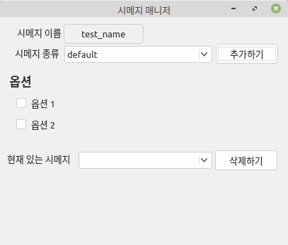

# shimeji-secretary
시메지 기능을 가진 비서 프로그램

### 컨셉

**시메지 매니저** : 시메지 생성 및 삭제를 관리
- 이름, 종류, 옵션을 선택하면 그 이름과 타입의 시메지를 생성 가능
- 현재 삭제 기능은 구현 안됨



**시메지** : 옮길 수 있고 다양한 기능을 소유
- 짚을 수 있음.
- 특정 상황에 따라서 다른 행동을 취함.
- 다양한 종류를 만들어서 기능 부여 가능.


### 파일 구조

```python
├── core # 핵심이 되는 기능 모음
│   ├── drawer # 메인 윈도우 및 시메지를 그리는 기능
│   │   └── entity # 시메지 그리는 기능
│   ├── resource_handle # 리소스 관리를 위한 DB 역할
│   ├── shimeji # 시메지를 만들기 위한 빌더와 엔티티
│   │   └── base # 기본 빌더와 엔티티
│   └── system # 전체 시스템의 기본 구조임
│       └── queue # 데이터 교환을 위한 큐
├── thirdparty # 외부 라이브러리 넣는용
├── utility # 각종 유틸리티 함수 모아둠
└── widget_resource # 각종 리소스를 모아둠
    └── shimeji # 시메지의 기본 ui 및 폴더별로 타입을 가짐
        └── emoji_state # 이모지 타입의 state용 이미지를 가짐
```
